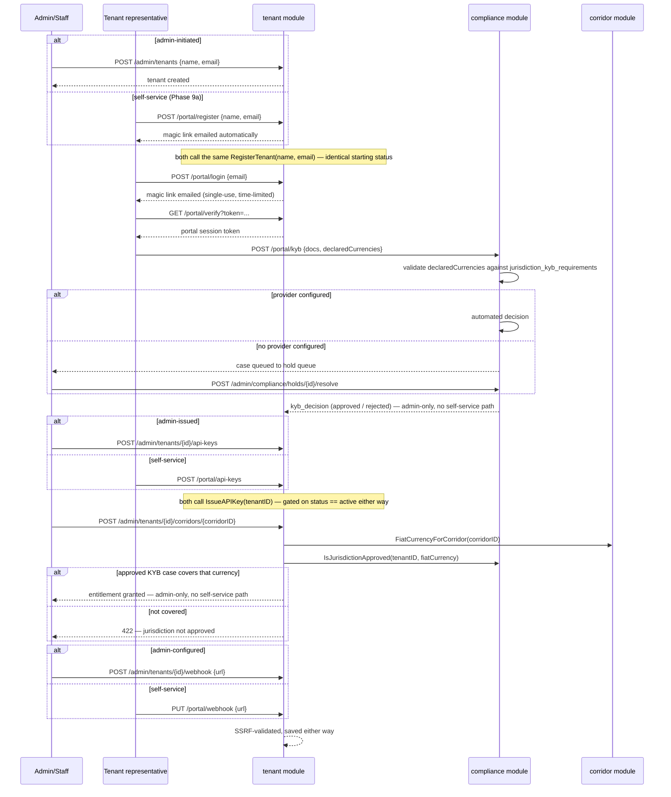
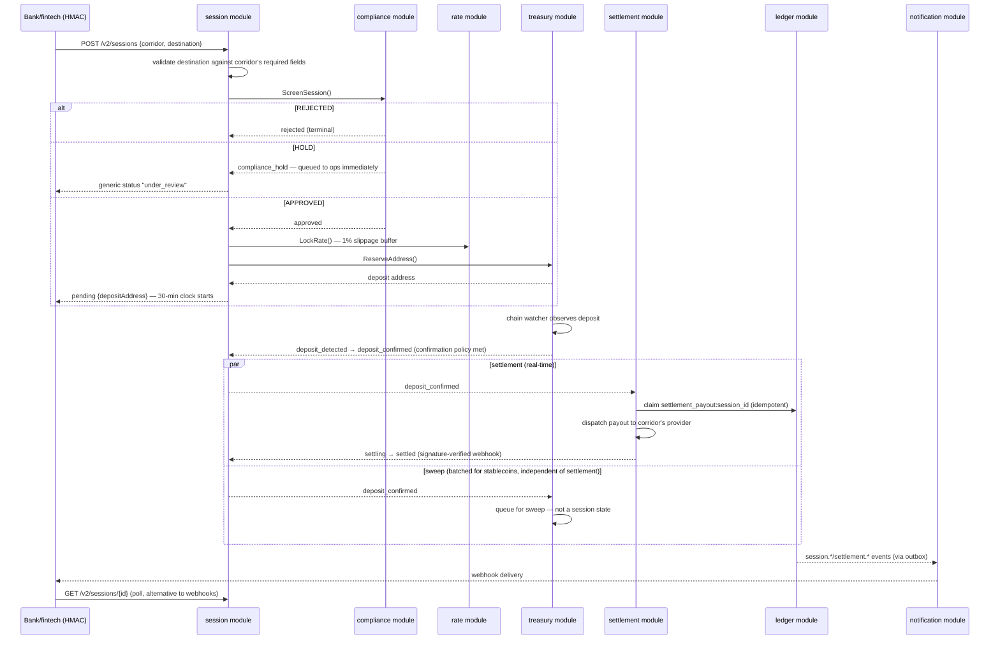
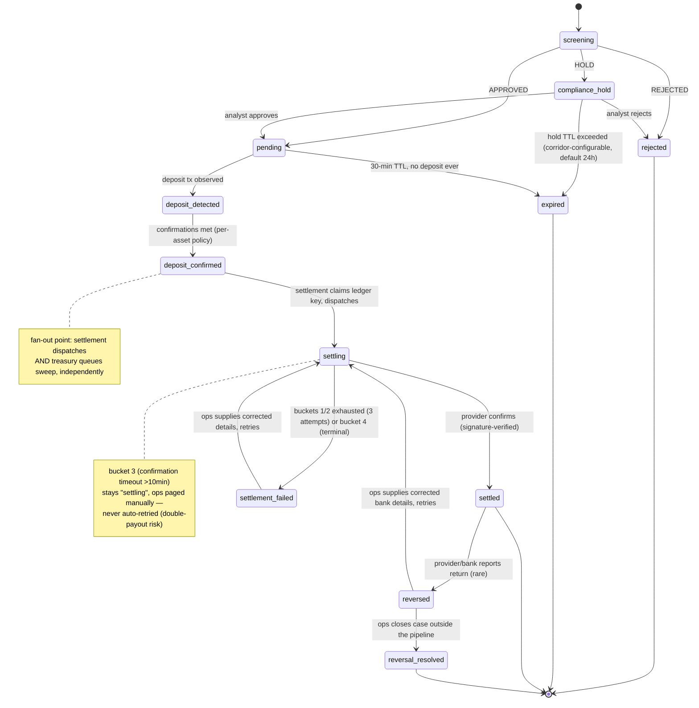

# Payment Rail v2 — Architecture & Design Decisions

Status: living design doc. Implementation is well underway, not pre-implementation — see `docs/IMPLEMENTATION_PLAN.md` for build order and current phase status. Update as decisions change — don't let this drift from reality.

## 1. What this is

A crypto-to-fiat payment rail, built as a modular monolith in Go + PostgreSQL, designed for banks and fintechs (UBA first, Nigeria) to plug into as a settlement rail: collect crypto, settle fiat to bank accounts. Every fiat currency, crypto asset, collection partner, settlement partner, and compliance provider must be addable via configuration, without a redeploy, wherever that's realistically possible — the exception is a genuinely new adapter *type* (a partner with a protocol shape nothing else fits), which costs one small Go package + a deploy, not a core-system change.

## 2. Regulatory posture & custody

- Not yet a licensed VASP in Nigeria; VASP application in progress. Busha (licensed) covers this today under an SLA.
- Custody model is a **property of the collection provider**, not a fixed system-wide assumption:
  - **Self-custody**: own HD-derived wallets hold crypto between deposit and settlement.
  - **Partner-custodied**: e.g. Busha holds funds; the rail only orchestrates via their API.
  - A corridor picks a collection provider; that provider's type determines which custody model applies. Both must be pluggable.
- Tenant = the integrating bank/fintech, each with a KYB record. End-user KYC is vouched for by the tenant, not performed by this system.
- Settlement is via partnerships with licensed PSPs/aggregators and local clearing through banks/fintechs; multiple settlement partners per corridor, for redundancy/failover.

## 3. Decision log

| Area | Decision |
|---|---|
| Custody | Configurable per collection provider — self-custody (own HD wallet) or partner-custodied (Busha, others), pluggable |
| Key management | Self-run HD wallets; key-encryption key lives in a managed KMS/Vault, never colocated with the ciphertext it protects |
| Deposit address | Reuse per end-user (self-custody provider), DB-enforced one-open-session-per-address constraint |
| Sweep | Per-asset config, keyed on `volatility_class`: volatile assets sweep immediately on confirmation (minimize price exposure); stable assets (USDT) batch at a configurable balance threshold + time backstop |
| Settlement trigger | Fires on `deposit_confirmed`, **not** on sweep completion — settlement must be real-time even though stablecoin sweep is batched, so the two are independent consumers of the same event |
| Compliance | Synchronous, blocking check at session creation; multi-provider, routed by settlement currency/corridor; manual-review hold queue as fallback where no provider is configured; Travel Rule thresholds configurable per currency (rolling-window volume check) |
| FX / rates | In-house rate engine aggregating partner quotes vs. a DB-set system rate; system rate acts as a ceiling — external providers can only push the locked rate down, never up (ported from v1, confirmed to carry forward) |
| Tenant auth | Per-tenant configurable: API key + HMAC signature, or mTLS |
| Tenant portal auth | Separate passwordless surface for the tenant's own KYB submission: email magic link (`POST /portal/login`) → single-use, time-limited, hashed token → session token (`GET /portal/verify?token=...`). Own credential space (`tenant_magic_links`/`tenant_sessions`), never accepted on gateway (HMAC/mTLS) or admin routes, or vice versa |
| Admin auth | Password (bcrypt hash + DB-backed session, per-admin identity) is the baseline; OIDC SSO is an additional front door onto the *same* session model — any OIDC-compliant IdP, invite-only (never self-provisions an `admin_users` row), binds to the IdP's `sub` claim. Password login stays as a break-glass fallback once SSO is configured, not deleted |
| KYB jurisdiction requirements | Per-fiat-currency required-fields config (`jurisdiction_kyb_requirements`, admin-configurable; unconfigured currency = no extra requirement). Every KYB case declares which currencies/jurisdictions it's onboarding for (`declared_currencies`); validated against the union of those currencies' required fields before a case is even created |
| Corridor entitlement grant | Activating an entitlement (`GrantCorridorEntitlement`) is gated on an approved KYB case whose `declared_currencies` cover the corridor's fiat currency — an approval for one jurisdiction can't be used to unlock a corridor under a different regulator. Revocation (`SetCorridorEntitlement(..., false, ...)`) doesn't need the gate |
| Session TTL/SLA | 30 minutes from creation is the target for the *entire* flow (create → lock rate → deposit → confirm → settle). No deposit ever arriving → `expired` at 30 min (terminal, address freed). Deposit already in flight and not yet `settled` at 30 min → status keeps showing the real pipeline stage (never force-abandoned), a separate `sla_breached_at` timestamp is set and the relevant people are notified immediately |
| Ledger | Double-entry, core primitive from day one — every value movement is a balanced transaction, account balances are always derived, never mutated directly |
| Monolith design | Modular monolith, hard package boundaries (no cross-module table access), transactional outbox + in-process event dispatcher for fan-out, direct interface calls for blocking critical-path operations (e.g. compliance gate). Event bus swappable for a real broker at microservice-split time without touching module logic |
| Hosting | VPS for now (cost-conscious, pre-revenue); hard migration gate to a proper cloud provider (managed Postgres w/ PITR, real KMS, VPC isolation) before the first bank partner goes live — bank infra/security due-diligence will not pass on a shared VPS |
| Go stack | `chi`/`net-http`, `pgx` + `sqlc` (no ORM — full control over ledger transaction/lock behavior), `golang-migrate`, goroutine+ticker background workers coordinated via `SELECT ... FOR UPDATE SKIP LOCKED` |
| Assets (launch) | BTC, ETH, BNB, TRX, and USDT on those chains |
| Payout destination | Per-session, tenant-supplied at `CreateSession` — never a static tenant-level field, since one tenant can hold entitlements across multiple corridors/currencies at once. Corridor defines which destination fields are required for its fiat currency; validated immediately after the corridor lookup, before screening/rate-lock/address-reservation proceed |

## 4. Lessons carried forward from the v1 security audit

A full audit of the existing (Node/MySQL) "2Settle" payment engine at `C:\Users\hp\Projects\2settle\payment-engine` surfaced several critical findings that directly shape this design — see full findings in conversation history. The load-bearing lessons:

1. **No ledger existed** in v1 — the only source of truth for "has this been paid out" was a mutable status column, which is exactly what a race condition exploited to cause a double payout. → Ledger is non-negotiable here, and every status transition in this system is a `WHERE status = <expected>` compare-and-set, never a blind write.
2. **Seed decryption key stored next to its own ciphertext** in `.env`. → Key-encryption key must live in a KMS/Vault, structurally separated from the app config surface.
3. **No DB-level uniqueness on reused deposit addresses** — an app-level check-then-insert let one deposit fund two sessions. → The address-reuse model here requires a real DB constraint, not an app-level check.
4. **Settlement webhooks trusted an optional IP allowlist with no signature verification.** → Every provider callback in this design must be signature-verified, full stop; IP allowlisting is defense-in-depth, never the primary gate.
5. **Cross-tenant authorization gaps** (a claim endpoint with no ownership check). → Every module's write path asserts caller/tenant ownership explicitly; nothing is "secure by obscurity" of an ID being hard to guess.

## 5. Module map

Nine business bounded contexts + one shared platform layer. Each module owns its tables exclusively — nothing reaches into another module's tables directly, only through its exported interface or its published events.

| Module | Owns | Exposes (sync) | Publishes (async) | Subscribes |
|---|---|---|---|---|
| **tenant** | Tenant profile, fee schedule, corridor entitlements, API keys/HMAC secrets, mTLS cert refs, webhook config, portal magic links/sessions (passwordless tenant-representative login) | `GetTenant`, `ValidateCredentials`, `CheckEntitlement`, `GrantCorridorEntitlement` (jurisdiction-gated, calls into `compliance`/`corridor`) | `tenant.onboarded`, `tenant.suspended` | `compliance.kyb_decision` |
| **compliance** | KYB cases (with declared currencies/jurisdictions), transaction screening cases, jurisdiction KYB requirements (required fields per fiat currency), provider registry (by corridor/currency), hold queue, rolling Travel Rule volume aggregates | `ScreenTenant()`, `ScreenSession()` — both sync, blocking; `IsJurisdictionApproved()` | `compliance.kyb_decision`, `compliance.session_decision`, `compliance.hold_created/resolved` | `session.deposit_confirmed` (updates rolling volume) |
| **corridor** | Corridor definitions (asset+network × fiat currency), provider bindings + priority/failover, limits, Travel Rule thresholds, `compliance_hold_timeout` (default 24h, overridable per corridor), payout-destination field requirements per fiat currency | `GetCorridor`, `ListActiveProviders()` | `corridor.updated` | — |
| **session** | Session state machine, deposit-address reference, rate-lock reference, compliance-decision reference, tenant-supplied payout destination | `CreateSession`, `GetSession` | `session.created`, `session.deposit_detected`, `session.deposit_confirmed`, `session.expired` | `treasury.deposit_detected/confirmed` |
| **treasury** | Collection provider adapters (self-custody HD wallet + partner-custodied), address reservations, watcher state, sweep execution, custody balances | `GetDepositInstructions()`, `ReserveAddress()` | `treasury.deposit_detected`, `treasury.deposit_confirmed`, `treasury.swept` | `session.created` |
| **rate** | Rate provider registry, aggregated snapshots, session-scoped rate locks | `LockRate()` — sync | `rate.locked`, `rate.expired` | — |
| **settlement** | Settlement provider adapters, payout dispatch records, provider failover state | (internally triggered) | `settlement.dispatched`, `settlement.completed`, `settlement.failed` | `session.deposit_confirmed` |
| **ledger** | Accounts, entries, transactions (append-only), balance cache | `Post()` — the *only* write path | `ledger.posted` | Nearly everything |
| **notification** | Webhook subscriber config, delivery log, dead-letter queue | — | — (terminal consumer) | `session.*`, `settlement.*`, `compliance.hold_created` |
| **platform** (shared kernel) | Tenant gateway (HMAC/mTLS auth), **admin/internal auth** (separate credential space for staff; password + optional OIDC SSO), outbox/eventbus, inbound-request idempotency store, db/migrations | used by all modules | — | — |

**Key flow decision**: `settlement` subscribes to `session.deposit_confirmed`, not `treasury.swept`. Sweep can be batched (stablecoin policy); settlement must be real-time. They are independent consumers of the same event, not a pipeline.

**Three distinct auth surfaces, not one**:
1. **Tenant-facing API auth** (API key+HMAC or mTLS, per `tenant`'s config) gates the API banks/fintechs call.
2. **Admin/internal auth is separate** — staff reviewing KYB submissions, resolving compliance holds, managing corridor config, or retrying settlements need their own authenticated identity, not a shared secret. This is a direct lesson from the v1 audit: v1 gated all of `/admin/*` (including wallet-destination config and API-key management) behind a single shared `ADMIN_SECRET` compared with a non-constant-time `!==`, with no per-admin identity and no attempt limiting. v2 needs per-admin credentials (not one shared token), constant-time/hashed comparison, and audit logging of who did what — this surface gates some of the most sensitive actions in the system (wallet config, compliance decisions, manual settlement), so it deserves at least as much rigor as tenant auth, arguably more. OIDC SSO now sits in front of this as an alternative login path (Phase 13) — it only changes *how* an admin proves identity; sessions are still the same DB-backed `admin_sessions` token issued the same way, and password login remains as a break-glass fallback.
3. **Tenant portal auth is its own third surface**, built in Phase 9a as a genuine tenant self-service surface — not just a KYB form: `POST /portal/register` lets a tenant create its own record with no admin involved at all, and once KYB clears the tenant can self-issue its own API key (`POST /portal/api-keys`) and set its own webhook (`PUT /portal/webhook`), alongside tenant-scoped reads of its own sessions/settlements/balance/notifications. A tenant representative (not a bank/fintech's server-to-server integration) proves who they are via a passwordless email magic link, gets a session token, and that token is only ever accepted on `/portal/*` routes — never on gateway or admin routes, since it's a *person at the tenant company*, who has no HMAC secret or mTLS cert (those aren't issued until after KYB clears) and shouldn't share the admin credential space either. Phase 12 later built on this surface to make KYB submission exclusively portal-only, removing the admin-submitted alternative that existed before — see the onboarding workflow below for which steps are admin-only vs. either-path.

None of the three credential spaces are interchangeable, and none of their session/token tables are shared.

**Onboarding is a workflow, not a new module** — it's the sequence that ties `tenant` and `compliance` together, worth naming explicitly since it's easy to lose track of as "just tenant CRUD":

1. Tenant registration (`tenant`) — **either path creates the identical record**, via the same `RegisterTenant(name, email)` call: staff create it on the tenant's behalf (`POST /admin/tenants`), or the tenant registers itself (`POST /portal/register`, Phase 9a, which also auto-sends the portal login magic link on success). Either way the record starts in the same status, and the tenant can't call the API yet, and can't submit KYB either until it logs into the portal.
2. Portal login + KYB submission (`tenant` portal auth + `compliance`) — **portal-only, never admin-submitted on the tenant's behalf** (Phase 12), regardless of which path created the record: the tenant's own representative requests a magic link (`POST /portal/login`), redeems it for a session (`POST /portal/verify`), then submits company/beneficial-ownership/licensing documents itself (`POST /portal/kyb`) — declaring which fiat currencies/jurisdictions it's onboarding for, validated against each jurisdiction's configured required fields (Phase 10) before a case is even created. Admin's role here is review/resolve only.
3. KYB review (`compliance`, via admin/internal auth) — **admin-only, no self-service path** — automated provider decision, or manual review through the hold queue if no provider is configured for that case.
4. Credential issuance (`tenant`) — **either path**, via the same `IssueAPIKey(tenantID)` call, gated on the tenant's status being `active` either way (nothing issued before KYB clears): admin does it (`POST /admin/tenants/{id}/api-keys`), or the tenant self-issues (`POST /portal/api-keys`, Phase 9a). Generating/registering an mTLS cert, where used instead of API key+HMAC, stays admin-only.
5. Corridor entitlement assignment (`tenant` + `corridor`, gated by `compliance`) — **admin-only, no self-service path** — which asset/currency corridors this tenant may use, and any limits. Granting one (`GrantCorridorEntitlement`, Phase 10) only succeeds if the tenant has an approved KYB case whose declared currencies actually cover that corridor's fiat currency, so a jurisdiction's approval can't be used to unlock a corridor a different regulator was never cleared for.
6. Webhook config (`tenant`) — **either path**: admin sets it (`POST /admin/tenants/{id}/webhook`), or the tenant sets its own (`PUT /portal/webhook`, Phase 9a); both validated against SSRF (private/loopback ranges rejected) per the v1 audit finding on this exact gap.

Steps 3 and 5 are the only genuinely admin-only steps — both are judgment calls (a compliance decision, a business/limits decision), not paperwork a tenant could self-serve. Only after step 4 can a tenant call the API at all; only after step 5 can they create a session on a given corridor.

## 6. System & flow diagrams

Visual complement to §5's module-map table and §9's transition table — same information, drawn out. Reflects the system as it stands through Phase 13 (admin SSO/OIDC): three auth surfaces, self-service onboarding alongside the admin-driven path, portal-only KYB submission, jurisdiction-gated corridor entitlements.

### High-level architecture

```
                                    ┌─────────────────────────────────────────┐
                                    │                 CLIENTS                  │
                                    └─────────────────────────────────────────┘
                    ┌────────────────────────┼────────────────────────┐
                    ▼                         ▼                        ▼
        ┌──────────────────────┐ ┌──────────────────────┐ ┌──────────────────────┐
        │  Bank / fintech       │ │  Tenant representative │ │  2settle staff (ops)    │
        │  (server-to-server)   │ │  (browser)              │ │  (browser)             │
        └───────────┬───────────┘ └───────────┬───────────┘ └───────────┬───────────┘
                    │                         │                        │
                    ▼                         ▼                        ▼
        ┌──────────────────────┐ ┌──────────────────────┐ ┌──────────────────────┐
        │  gateway               │ │  portal auth           │ │  admin auth            │
        │  API key + HMAC        │ │  passwordless magic    │ │  password (bcrypt) or  │
        │  signature, or mTLS,    │ │  link → session token, │ │  OIDC SSO (invite-only,│
        │  per-tenant config      │ │  self-registration,     │ │  bound to IdP `sub`)   │
        │                         │ │  KYB, self-service      │ │                        │
        │                         │ │  credentials/webhook    │ │                        │
        └───────────┬───────────┘ └───────────┬───────────┘ └───────────┬───────────┘
                    │                         │                        │
                    │        three separate credential spaces —        │
                    │        no token is ever valid across surfaces    │
                    └─────────────────────────┼────────────────────────┘
                                              ▼
        ┌───────────────────────────────────────────────────────────────────────────────┐
        │                     PAYMENT RAIL CORE (modular monolith, Go)                      │
        │                                                                                   │
        │  ┌────────┐ ┌───────────┐ ┌─────────┐ ┌────────┐ ┌─────────┐ ┌──────┐ ┌────────┐ │
        │  │ tenant │ │compliance │ │corridor │ │session │ │treasury │ │ rate │ │settlement│ │
        │  └───┬────┘ └─────┬─────┘ └────┬────┘ └───┬────┘ └────┬────┘ └──┬───┘ └────┬─────┘ │
        │      └────────────┴────────────┴───────────┴───────────┴─────────┴──────────┘     │
        │                                          │                                          │
        │                                          ▼                                          │
        │                              ┌──────────────────────┐        ┌────────────────┐     │
        │                              │        ledger          │◀──────│  notification   │     │
        │                              │  (the only write path) │       │  (webhooks out) │     │
        │                              └──────────────────────┘        └────────────────┘     │
        │                                                                                       │
        │      platform (shared kernel): outbox/eventbus, idempotency store, db/migrations      │
        └───────────────────────────────────────────────────────────────────────────────────────┘
                                              │
                                              ▼
        ┌───────────────────────────────────────────────────────────────────────────────────┐
        │                                    POSTGRESQL                                         │
        │   tenants · tenant_magic_links/tenant_sessions · admin_users (+oidc_subject) ·         │
        │   compliance_cases (+declared_currencies) · jurisdiction_kyb_requirements ·            │
        │   corridors · sessions · treasury reservations/wallets · rate_locks · settlements ·     │
        │   ledger_accounts/entries/transactions/balances · outbox_events · request_audit_log     │
        └───────────────────────────────────────────────────────────────────────────────────────┘
```

### Onboarding flow



### Transaction flow



### Session state machine



`sla_breached_at` (a nullable timestamp, not a state) is set orthogonally at the 30-minute mark for any session past `pending` that hasn't reached `settled` yet — see §9 below for the full rule; it never appears as a node here because it never changes which state a session is in.

## 7. Ledger schema

```sql
CREATE TABLE ledger_accounts (
    id            UUID PRIMARY KEY DEFAULT gen_random_uuid(),
    tenant_id     UUID NULL REFERENCES tenants(id),      -- NULL for platform/omnibus accounts
    account_type  TEXT NOT NULL,                          -- see taxonomy below
    asset_code    TEXT NOT NULL,                           -- 'USDT-TRC20', 'BTC', 'NGN', 'ZMW'...
    unit_type     TEXT NOT NULL CHECK (unit_type IN ('crypto','fiat')),
    name          TEXT NOT NULL,
    created_at    TIMESTAMPTZ NOT NULL DEFAULT now(),
    UNIQUE (tenant_id, account_type, asset_code)
);

CREATE TABLE ledger_transactions (
    id               UUID PRIMARY KEY DEFAULT gen_random_uuid(),
    idempotency_key  TEXT NOT NULL UNIQUE,     -- e.g. 'settlement_payout:session_123'
    txn_type         TEXT NOT NULL,             -- 'deposit_confirmed','fx_conversion','sweep',
                                                  -- 'settlement_payout','fee','reversal','manual_adjustment'
    reference_type   TEXT NOT NULL,             -- 'session', 'settlement', ...
    reference_id     UUID NOT NULL,
    created_by       TEXT NOT NULL,             -- owning module name
    created_at       TIMESTAMPTZ NOT NULL DEFAULT now()
);

CREATE TABLE ledger_entries (
    id              UUID PRIMARY KEY DEFAULT gen_random_uuid(),
    transaction_id  UUID NOT NULL REFERENCES ledger_transactions(id),
    account_id      UUID NOT NULL REFERENCES ledger_accounts(id),
    direction       TEXT NOT NULL CHECK (direction IN ('debit','credit')),
    amount          NUMERIC(36,18) NOT NULL CHECK (amount > 0),
    asset_code      TEXT NOT NULL,
    created_at      TIMESTAMPTZ NOT NULL DEFAULT now()
);

-- Derived cache only — always reconstructable by summing ledger_entries.
-- A periodic reconciliation job recomputes and flags drift; never the source of truth.
CREATE TABLE ledger_balances (
    account_id  UUID PRIMARY KEY REFERENCES ledger_accounts(id),
    balance     NUMERIC(36,18) NOT NULL DEFAULT 0,
    updated_at  TIMESTAMPTZ NOT NULL DEFAULT now()
);
```

**Account taxonomy**: `treasury_in_transit:{asset}`, `treasury_custody:{asset}`, `crypto_fx_clearing:{asset}`, `fiat_fx_clearing:{currency}`, `tenant_payable:{tenant}:{currency}`, `treasury_fiat_operating:{currency}`, `fee_revenue:{currency}`, `compliance_hold:{asset}`.

**Invariant**: within a single `ledger_transactions.id`, entries balance *per asset_code*. A currency conversion is two linked, independently-balanced transactions (same `reference_id`), bridged through the `*_fx_clearing` accounts — never one mixed-unit transaction. Enforced entirely in the `ledger.Post()` code path; nothing else is allowed to write to `ledger_entries`.

**Worked example** — 100 USDT-TRC20 → NGN, self-custody, 1% fee:

| Step | Txn (`idempotency_key`) | Debit | Credit |
|---|---|---|---|
| Deposit confirmed (locked: 100 USDT = ₦162,000) | `deposit_confirmed:session_123` | `treasury_in_transit:USDT` 100 | `crypto_fx_clearing:USDT` 100 |
| Fiat liability recognized | `fx_conversion:session_123` | `fiat_fx_clearing:NGN` 162,000 | `tenant_payable:{tenant}:NGN` 160,380 + `fee_revenue:NGN` 1,620 |
| Settlement dispatched (fired by deposit_confirmed, not sweep) | `settlement_payout:session_123` | `tenant_payable:{tenant}:NGN` 160,380 | `treasury_fiat_operating:NGN` 160,380 |
| Sweep (async, batched per stablecoin policy) | `sweep:batch_456:session_123` | `treasury_custody:USDT` 100 | `treasury_in_transit:USDT` 100 |

The `settlement_payout:session_123` idempotency key is the direct structural fix for v1's double-payout bug: `settlement` must successfully claim this ledger transaction (unique-constraint insert) *before* calling the external provider. If the insert is rejected as a duplicate, another trigger already claimed the payout — abort, don't call the provider. On provider-reported failure, a compensating `settlement_reversal:session_123` transaction reverses it, and a retry claims a new attempt-scoped key.

## 8. Rate engine (ported from v1, adapted)

Reusing the v1 design — it's sound and maps cleanly onto the `rate` module:

- Provider adapters (Busha, LiquidRamp, Anchor, System) implementing `{name, isEnabled(), fetchRate()}`.
- Background pre-fetch job (goroutine+ticker) polls providers, writes to `provider_rates`, so in-band transaction processing never makes a live external call.
- Selection rule: lowest quote among external providers, then take the min against the DB-set system rate. System rate is a ceiling — external providers can only push the locked rate down. Confirmed to carry forward as-is.
- `LockRate()` combines fiat/USD rate + crypto/USD asset price (CoinMarketCap) into a lock with a 1% slippage buffer and an expiry.

Adaptations from the v1 implementation (not a blind copy):

1. **MySQL → Postgres**: `provider_rates` and `rates` (merchant_rate/profit_rate) tables — `AUTO_INCREMENT`→`GENERATED ALWAYS AS IDENTITY`, `ON DUPLICATE KEY UPDATE`→`ON CONFLICT DO UPDATE`, drop `ENGINE=InnoDB`.
2. **Fiat currency list must become corridor-driven.** v1 hardcodes `FIAT_CURRENCIES = ['NGN']` — a code change + redeploy to add Zambia. Read the active-currency list from `corridor` instead.
3. **Add a persisted `rate_locks` table** (v1 keeps the lock only in memory, embedded into the session). Gives the ledger's `fx_conversion` entries a concrete record of which quote and providers produced the locked rate — needed for audit/reconciliation.

Known gap, not blocking: asset-price lookups (crypto/USD) only call CoinMarketCap, with no fallback — unlike the fiat side's 4-provider aggregation. Revisit post-pilot.

## 9. Session state machine

### States

| State | Meaning |
|---|---|
| `screening` | Session request received; compliance check in flight (initial state, usually resolves within the same request) |
| `compliance_hold` | Flagged for manual review; no deposit address issued yet (so no custody/address-release concerns while held). Times out per the corridor's configured `compliance_hold_timeout` (see below) |
| `rejected` *(terminal)* | Compliance rejected the session outright |
| `pending` | Approved; deposit address/instructions issued; 30-min TTL clock running |
| `expired` *(terminal)* | 30-min TTL elapsed with **no deposit ever detected** (or a compliance hold timed out unresolved) — the only case where the session is safely abandoned and the address freed |
| `deposit_detected` | An on-chain transaction has been observed at the address; confirmations accumulating |
| `deposit_confirmed` | Confirmation threshold met per the asset's confirmation policy — this is the fan-out point |
| `settling` | Settlement claim posted atomically to the ledger; payout dispatched to the provider |
| `settled` *(terminal)* | Provider confirmed payout complete via a signature-verified webhook |
| `settlement_failed` | Provider reported failure, or the response timed out; retry-eligible up to a bounded attempt count |
| `reversed` | Provider/bank reported a return after an initial success (rare). Crypto side is untouched — this is purely a fiat-redelivery problem (bad bank details, receiving-bank compliance hold, closed account). Not terminal: awaits ops resolution via a `settlement`-owned reversal case, visible through the admin-auth ops surface |
| `reversal_resolved` *(terminal)* | Ops closed the reversal case outside the automated settlement pipeline (funds credited to the tenant's balance, refunded another way, or escalated), posted via the ledger's existing `manual_adjustment` transaction type |

**Orthogonal to status — `sla_breached_at` (nullable timestamp).** Every session carries this alongside its status. A background check sets it once, at the 30-minute mark from creation, if `settled` hasn't been reached yet. It is **not** a state in the machine above, never overrides the visible status, and never blocks or alters a transition — a session with a deposit already in flight keeps progressing through `deposit_detected → deposit_confirmed → settling → settled` exactly as normal after breaching. Anyone querying the session still sees its true pipeline stage; the flag exists purely to trigger notification and reporting ("this one blew the 30-minute SLA, go look at it") without ever abandoning real funds. Only a session with **no deposit yet** (`screening`/`compliance_hold`/`pending`) actually terminates at 30 minutes, via `expired`.

**`compliance_hold_timeout` is corridor-configurable, not a fixed platform constant** — a field on `corridor` config (falls back to a 24h platform default if a corridor doesn't set its own), since a higher-risk or newly-added corridor may warrant a longer review window than an established one. On entering `compliance_hold`, the case is added to the ops queue immediately (not deferred until the timeout nears) and the tenant is notified with a generic status only (e.g. `under_review`) — never the specific screening reason, consistent with not leaking compliance details to the client side. **The compliance case outlives the session**: if the hold times out and the session expires, that's a statement about this transaction attempt only — the underlying case stays open in `compliance`'s own records for audit trail and any regulatory obligation, and the user is free to retry with a new session, which is freshly screened. Session expiry must never silently close a compliance case.

### Transitions

```
screening ──APPROVED──────────────▶ pending
screening ──HOLD───────────────────▶ compliance_hold
screening ──REJECTED───────────────▶ rejected

compliance_hold ──analyst approves─▶ pending
compliance_hold ──analyst rejects──▶ rejected
compliance_hold ──hold TTL exceeded▶ expired

pending ──deposit tx observed──────▶ deposit_detected
pending ──30-min TTL, no deposit───▶ expired

deposit_detected ──confirmations met (per-asset policy)──▶ deposit_confirmed

deposit_confirmed ──fan-out (parallel, independent):
    ├─▶ settlement claims ledger idempotency key, dispatches ──▶ settling
    └─▶ treasury queues for sweep per per-asset policy (NOT a session state — see below)

settling ──provider confirms success (signature-verified)─────────────▶ settled
settling ──bucket 1/2 failure (rejected/explicit async fail)──────────▶ auto retry/failover (see policy below)
settling ──bucket 3 (accepted, confirmation webhook overdue >10 min)──▶ stays settling, ops paged for manual verification
settling ──bucket 4 (terminal rejection, e.g. invalid account)────────▶ settlement_failed, no auto-retry

settlement_failed ──ops supplies corrected details, triggers retry──▶ settling  [new attempt-scoped idempotency key]
settlement_failed ──auto-retry cap (3 attempts) exhausted on buckets 1/2──▶ stays settlement_failed, ops paged immediately (not deferred to sla_breached_at)

settled ──provider/bank reports return (rare, signature-verified)──▶ reversed
    [ledger: settlement_reversal:session_123 — reopens tenant_payable liability]

reversed ──ops supplies corrected bank details, triggers retry──▶ settling
    [new attempt-scoped idempotency key, e.g. settlement_payout:session_123:attempt_2;
     same bounded attempt cap as settlement_failed retries]
reversed ──ops closes case outside the pipeline──▶ reversal_resolved
    [ledger: manual_adjustment posting wherever the funds actually ended up]

[background, every session, from 30 min after creation]:
  IF status IN (screening, compliance_hold, pending) AND no deposit ever detected ─▶ expired
  ELSE IF status NOT IN (settled, expired, rejected) AND sla_breached_at IS NULL
       ─▶ set sla_breached_at = now(), notify — status itself is untouched
```

### Settlement retry policy

Applies to both `settling → settlement_failed` and `reversed` retries — one shared policy, not two.

**Failure classification** (the provider adapter's job — only it knows that provider's error semantics):

1. **Rejected before acceptance** — network error, dispatch-call timeout, or explicit synchronous rejection. Provider never took custody of the request. Auto-retry/failover eligible.
2. **Explicit async failure** — provider accepted the dispatch, then its webhook explicitly reports failure/decline. Auto-retry/failover eligible — the provider has confirmed it won't process this attempt.
3. **Confirmation timeout** — provider accepted the dispatch, but no success/failure webhook arrives within **10 minutes**. **Never auto-retried.** The original request may still be in flight on the provider's side; blindly re-dispatching risks a real double bank transfer that the ledger's idempotency key can't prevent, since it only protects our internal accounting, not what the provider does with two separate dispatch calls. Status stays `settling`; ops is paged immediately for manual status verification with the provider. Only after a human confirms the original attempt genuinely failed does a retry happen, via the same ops-triggered path as a terminal rejection.
4. **Terminal rejection** — invalid account details, or the provider says this will never succeed. Zero automatic retries — same ops-triggered, corrected-details-required path as `reversed`.

**Auto-retry/failover mechanics (buckets 1 & 2 only)**: up to **3 attempts total**, cycling through the corridor's configured settlement providers in priority order — failing over to the next provider is preferred over re-trying the one that just failed, since a different provider's infrastructure is more likely to succeed than a degraded one. Backoff: attempt 1 immediate, attempt 2 immediate if a failover provider is available (no wait needed — different infra), attempt 3 after a short ~60s backoff. Total automatic window stays under ~2 minutes, so a failing corridor doesn't eat meaningfully into the 30-minute session SLA before a human is paged. Each attempt is its own ledger claim (`settlement_payout:session_123:attempt_N`), reusing the existing claim-then-reverse-on-failure pattern — a failed attempt posts a compensating `settlement_reversal:session_123:attempt_N` before the next attempt claims a fresh key.

Once the 3-attempt cap is exhausted on buckets 1/2, or immediately on bucket 4: `settlement_failed`, and ops is notified right away — this notification is independent of `sla_breached_at` and fires immediately on failure, not deferred to the 30-minute mark.

### Rules that matter

1. **The 30-minute TTL is a hard expiry only pre-deposit** (`screening`/`compliance_hold`/`pending`) — that's the one case where nothing real has happened yet and the session can be safely abandoned. **Once a deposit is sighted on-chain, 30 minutes becomes an SLA, not an expiry**: if `settled` isn't reached by then, `sla_breached_at` is set and the right people are notified immediately, but the session keeps working the real pipeline (confirmations, sweep, settlement) to actual completion — it is never force-abandoned, because the funds are already real and finite blockchain confirmation time isn't something the system controls. Every session still has one firm 30-minute promise either way: either it's done, or someone's been paged about it.
2. **Sweep is not a session status.** Settlement fires from `deposit_confirmed` directly and must never wait on sweep (batched for stablecoins). Sweep completion is tracked as an orthogonal fact (a `swept_at` timestamp or a `treasury` module record), not a state in this machine — this machine reflects the tenant/settlement-facing lifecycle, not internal treasury housekeeping.
3. **Every transition is a compare-and-set**, `UPDATE sessions SET status = ? WHERE id = ? AND status = <expected-prior-state>`, checking affected-row-count — never a blind write. This is the direct structural fix for v1's non-atomic settlement bug, applied uniformly to every transition in the machine, not just the settlement one.
4. **`settling → settled` requires a signature-verified provider webhook.** IP allowlisting is defense-in-depth only, never the sole gate — direct fix for v1's unauthenticated settlement webhook finding.
5. **The reserved deposit address is only released for reuse once the session reaches a terminal state** (`rejected`, `expired`, `settled`, or `settlement_failed` with exhausted retries) — consistent with the DB-enforced one-open-session-per-address constraint. `reversed` does **not** release the address either (it's a post-`settled` event; the address's reuse question was already resolved when the session first reached `settled`).
6. **A reversal never unwinds the crypto side.** Deposit confirmation, sweep, and the crypto-side ledger entries are untouched by a reversal — only the fiat leg (`tenant_payable` liability, the settlement payout entry) is compensated. Re-settlement, when ops triggers it, reuses the already-collected crypto's value; it never asks the depositor to send crypto again.
7. **Reversal retries are ops-triggered, never automatic** — same as terminal/bucket-3 settlement failures. A human supplies corrected bank details and approves the retry; the system never re-attempts a payout against the same failed details on its own.

### Payout destination

Not part of the original design pass — added after grounding Phase 6 in the actual code surfaced that nothing defined this at all: `settlement`'s first dispatch attempt passed `Destination: nil` unconditionally, and the only place a real destination ever entered the system was an ops-supplied correction on a `settlement_failed`/`reversed` retry (rule 7 above). There was no first-attempt path.

**Per-session, not per-tenant.** A tenant can hold entitlements across multiple corridors at once (e.g. both an NGN and a ZMW corridor), and it's the corridor picked at session creation — not the tenant — that determines the settlement currency/country. The payout destination is therefore necessarily a property of *the session*: supplied by the tenant in the `CreateSession` request body, never a static field on the tenant record.

**Corridor owns the requirement, not just the currency.** Corridor already determines the system rate (keyed by fiat currency), the effective fee (tenant's per-corridor override), and the settlement-provider failover list. Extending it to also define which destination fields a valid payout needs for that corridor (e.g. an NGN corridor requires account number + bank code; a ZMW corridor requires different fields) keeps one module as the single source of truth for "what does this corridor need to settle," instead of splitting that knowledge between `session` and whichever settlement provider adapter happens to run.

**Validated at `CreateSession`, immediately after the corridor lookup** — before compliance screening, rate lock, or deposit-address reservation ever run. An invalid or incomplete destination fails fast with a 400 there, rather than silently proceeding through the whole pipeline and only surfacing as a dispatch failure at settlement time, after crypto has already been collected.

**Carried, not re-entered, through to settlement.** `session.deposit_confirmed`'s subscriber (`settlement.handleDepositConfirmed`) copies the session's stored destination into the new `settlements` row as its `pending_destination` at creation, so the first dispatch attempt has a real destination instead of `nil`. This doesn't change the existing ops-correction path (rule 7): ops can still overwrite `pending_destination` with corrected details on a `settlement_failed`/`reversed` retry — the only change is that a value already exists on attempt 1, rather than the field sitting unused until the first failure.

### Open follow-ups

None outstanding — all items from the original design pass are resolved as of this section.

---
*Next: not yet decided — no open design blockers remain anywhere in this doc. Pick up from here.*
