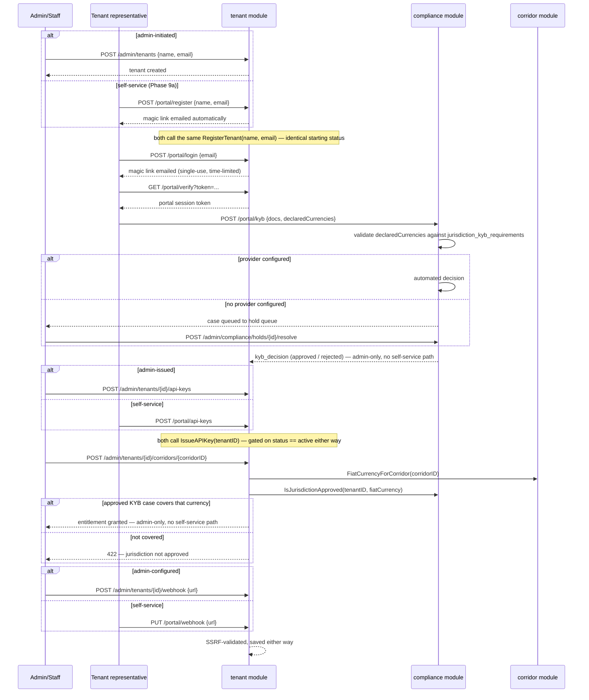
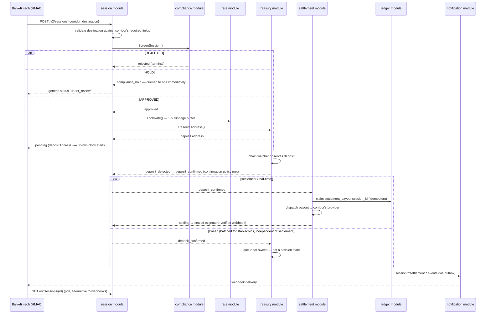
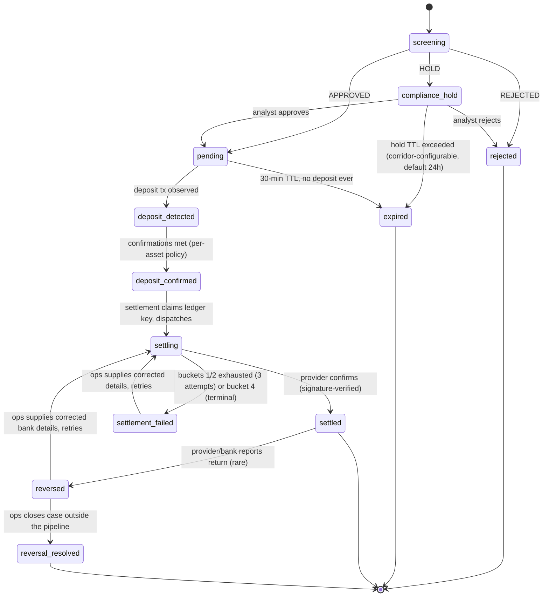

# Onboarding → Transaction Walkthrough

A narrative companion to `ARCHITECTURE.md` — that doc records design decisions; this one walks the actual request/event path end to end, from a bank/fintech's first onboarding call through a settled transaction. Grounded in the real HTTP surface (`cmd/server/router.go`) and module map (`ARCHITECTURE.md` §5), not just the design intent.

## Phase 1 — Onboarding a tenant

Tenant creation, credential issuance, and webhook config each have **two equally-real paths — admin-driven or tenant self-service** (`/v2/portal/...`, the tenant's own passwordless login, Phase 9a); both call the identical store method underneath, so which one ran is a business-process choice, not a different code path with different guarantees. KYB review and corridor entitlement stay admin-only — both are judgment calls, not paperwork:

1. **`POST /admin/tenants`** `{name, email}` (staff-initiated) **or `POST /portal/register`** `{name, email}` (self-service, Phase 9a — also auto-sends the login magic link) → both call `tenant.RegisterTenant`, creating an identical tenant record with a `contact_email`. Either way, can't call the API yet, and can't submit KYB either until it logs into the portal.
2. **Portal login + KYB submission** — **portal-only, never admin-submitted on the tenant's behalf** (Phase 12), regardless of which path created the record: the tenant requests a magic link (`POST /portal/login`), redeems it by clicking the emailed link (`GET /portal/verify?token=...`), then submits company/beneficial-ownership/licensing docs itself (`POST /portal/kyb`) into `compliance`.
3. **KYB review** — **admin-only, no self-service path** → automated provider decision, or if no provider is configured for that case, it drops into the manual hold queue — `GET /admin/compliance/holds` / `POST /admin/compliance/holds/{caseID}/resolve`, an analyst approves or rejects.
4. **`POST /admin/tenants/{tenantID}/api-keys`** (staff-initiated) **or `POST /portal/api-keys`** (self-service, Phase 9a) → both call `tenant.IssueAPIKey`, only reachable after KYB clears (`status == active`) either way. Issues the tenant's API key + HMAC secret (mTLS cert registration stays admin-only). **This is the gate** — nothing below is callable before this.
5. **`POST /admin/tenants/{tenantID}/corridors/{corridorID}`** — **admin-only, no self-service path** → entitles the tenant to a specific corridor (an asset+network × fiat-currency pair, e.g. USDT-TRC20 → NGN). Without this, `CreateSession` on that corridor is rejected.
6. **`POST /admin/tenants/{tenantID}/webhook`** (staff-initiated) **or `PUT /portal/webhook`** (self-service, Phase 9a) → tenant's callback URL, SSRF-validated (private/loopback ranges rejected) either way.

Only after step 4 can the tenant call anything at all; only after step 5 can they use a given corridor.

## Phase 2 — A transaction, end to end

### 1. Session creation

Tenant calls **`POST /v2/sessions`** (gateway-HMAC-authenticated), specifying the corridor and a payout destination (bank account details) — validated immediately against that corridor's required destination fields, before compliance, rate-lock, or address reservation ever run.

### 2. Screening (synchronous, inline)

`compliance.ScreenSession()` runs blocking inside the same request:

| Outcome | Result |
|---|---|
| **REJECTED** | Session terminates as `rejected`. |
| **HOLD** | `compliance_hold` — no deposit address issued yet. Queued to the ops hold queue immediately; tenant sees a generic `under_review` status, never the specific reason. Resolved via `POST /admin/sessions/{sessionID}/resolve`. Times out per the corridor's `compliance_hold_timeout` (default 24h) if nobody acts. |
| **APPROVED** | `pending` — `rate.LockRate()` locks the fiat/USD × crypto/USD rate (1% slippage buffer, sourced from the `current_rates` table the rate engine keeps warm), and `treasury.ReserveAddress()` / `GetDepositInstructions()` issues a deposit address. A 30-minute clock starts. |

### 3. Deposit

The end-user sends crypto to the issued address.

- `treasury`'s per-chain watcher (polling on `WATCHER_POLL_INTERVAL`) observes the on-chain transaction → session flips to `deposit_detected`, confirmations accumulate against that asset's confirmation-count policy.
- Confirmation threshold met → **`deposit_confirmed`**. This is the fan-out point.

### 4. Fan-out from `deposit_confirmed`

Two independent consumers of the same event — deliberately not a pipeline, so a batched sweep never delays real-time settlement:

- **`settlement`** — atomically claims a ledger idempotency key (`settlement_payout:session_<id>`; claim-then-call, never call-then-record — the direct structural fix for v1's double-payout bug), dispatches the fiat payout to the corridor's settlement provider → `settling`.
  - Provider's signature-verified success webhook → **`settled`** (terminal).
  - Failure is classified into 4 buckets: buckets 1–2 (rejected before acceptance / explicit async failure) auto-retry/failover up to 3 attempts across the corridor's providers, ~2 minutes total; buckets 3–4 (confirmation timeout / terminal rejection) never auto-retry — ops is paged immediately, since a blind retry there risks a real double bank transfer.
- **`treasury` sweep** — queues the collected crypto for sweep out of the deposit address into custody. Batched for stablecoins (balance threshold + time backstop), immediate for volatile assets. **Not a session state** — tracked as an orthogonal fact (`swept_at`), pure internal treasury housekeeping.

### 5. Ledger

Every step above posts balanced, double-entry transactions — `deposit_confirmed`, `fx_conversion`, `settlement_payout`, `sweep` (see the worked 100 USDT → NGN example in `ARCHITECTURE.md` §7). Nothing else is permitted to write to `ledger_entries`.

### 6. Tenant visibility

- **`GET /v2/sessions/{sessionID}`** for polling.
- Async webhook notifications (`session.*`, `settlement.*`, `compliance.hold_created`) delivered by the `notification` module to the URL configured in onboarding step 6.

### Terminal outcomes

| State | Meaning |
|---|---|
| `settled` | Success — provider confirmed payout. |
| `rejected` / `expired` | Nothing was ever collected. |
| `settlement_failed` | Payout failed; ops-correctable retry available. |
| `reversed` → `reversal_resolved` | Rare post-settlement bank return. Crypto side is **never** unwound — only the fiat leg (`tenant_payable` liability) is compensated. |

### The one SLA rule that ties it together

30 minutes is a **hard expiry** only pre-deposit (`screening` / `compliance_hold` / `pending` with nothing sighted on-chain — the only case where nothing real has happened yet). Once a real deposit exists, 30 minutes becomes an **SLA flag** (`sla_breached_at`) instead of an abandonment — the session keeps running the real pipeline to actual completion, never force-abandoned, because the funds are already real and blockchain confirmation time isn't something the system controls.

---
*See `ARCHITECTURE.md` for the full design rationale and decision log behind each of these steps, and `IMPLEMENTATION_PLAN.md` for what's built vs. still open.*
